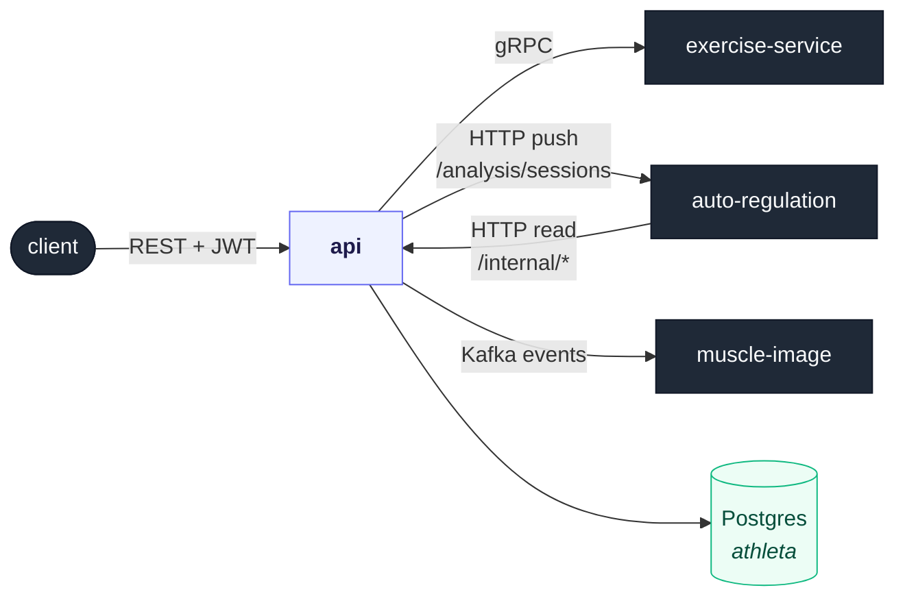

# api

The **gateway and orchestrator** for Athleta. It owns the user and workout
domain, fronts every client request behind one authenticated REST surface, and
composes the specialist services (exercise inference, auto-regulation, muscle
imagery) into coherent features. Built with NestJS.

---

## Why this exists

Athleta is split into domain services that each speak their own language: a Go
graph for exercises, a Python engine for training science, a PHP renderer for
images. Something has to be the front door and hold the user's identity, own
the data those specialists *don't*, and stitch their answers into one response.
That's this service.

Two rules keep the seams clean:

1. **api is the source of truth for the user & workout domain.** Athletes, plans,
   logged sessions, sets, recovery, and PRs live in *this* service's Postgres and
   nowhere else. When a workout is logged, api commits it **first** — before any
   downstream analysis runs — so the athlete's data is never hostage to another
   service being up.
2. **Specialists are consulted, not joined.** api never reaches into Neo4j or the
   `autoreg` database. It calls exercise-service over gRPC and pushes context to
   auto-regulation over HTTP; they compute and answer. Their domains stay theirs.

The payoff is that every cross-service concern — "which exercises did they do,
what do those muscles look like, how should next week change" — resolves in one
place, against one owner per fact.

---

## What it does

api exposes three distinct surfaces:

- **Public REST** (`/auth`, `/athletes`, `/plans`, `/workouts`, `/exercises`) —
  JWT-authenticated, the only surface reachable from the internet (via Traefik).
- **Internal contract** (`/internal/*`) — a narrow, service-token-authenticated
  read API that auto-regulation calls to fetch api-owned data instead of sharing
  a database.
- **Event bus** — a Kafka producer/consumer pair that drives asynchronous muscle
  image generation without blocking request handling.

---

## Architecture

### Where it sits



### The domain it owns (Postgres `athleta`)

Mapped with [Drizzle ORM](https://orm.drizzle.team/) in
[src/db/schema.ts](src/db/schema.ts). Other services reference these rows by
**integer ID only** — there are no cross-service foreign keys.

| Table | Holds |
| --- | --- |
| `users`, `refreshTokens`, `passwordResetTokens` | Auth identity and token lifecycle |
| `athletes` | Athlete profile (age, gender, experience, calibration factor) |
| `workoutPlans`, `workoutDays`, `workoutDayExercises` | The periodized plan blueprint |
| `workoutSessions`, `exerciseSets` | Logged workouts (the source of truth for what happened) |
| `recoveryMetrics` | Athlete-reported sleep / soreness / stress / energy |
| `exercisePersonalRecords` | Current PRs, updated from auto-regulation's write-backs |

### Modules

| Module | Responsibility |
| --- | --- |
| `modules/auth` | Registration, login, JWT issuance, refresh tokens; the global `JwtAuthGuard`. |
| `modules/athletes` | Athlete profiles and onboarding. |
| `modules/plans` | Workout-plan CRUD and periodization config (delegates strategy to auto-regulation). |
| `modules/workouts` | Workout days, exercise resolution, and the **completion orchestration** (below). |
| `modules/exercise` | Thin gRPC **client** for exercise-service — transports and reshapes, no exercise logic. |
| `modules/internal` | The `/internal/*` read API consumed by auto-regulation. |
| `modules/common` | Shared infra: `database` (Drizzle), `email`, `messaging` (Kafka producer). |


### Integration seams

Each outbound dependency is isolated behind one class, so the rest of the code
depends on an interface, not a transport:

- **`ExerciseClientService`** ([exercise-client.service.ts](src/modules/exercise/exercise-client.service.ts))
  — the gRPC client for `exercise.v1.ExerciseService`. The exercise domain lives
  in exercise-service; this class only transports and reshapes.
- **`AutoRegulationServiceIntegration`** ([integrations/](src/integrations/auto-regulation-service.integration.ts))
  — builds the analysis context and POSTs it; degrades gracefully when
  auto-regulation is unavailable.
- **`EventPublisher`** ([messaging](src/modules/common/messaging/event-publisher.service.ts))
  — the thin Kafka producer used to emit domain events.

---

## HTTP API

### Public (JWT-authenticated, via Traefik)

| Prefix | Purpose |
| --- | --- |
| `POST /auth/*` | Register, login, refresh, password reset. |
| `/athletes` | Athlete profile management. |
| `/plans` | Workout plans and periodization. |
| `/workouts` | Workout days, exercise resolution, and workout completion. |
| `/exercises` | Exercise lookup / inference (proxied to exercise-service over gRPC). |

### Internal (service-token, consumed by auto-regulation)

| Endpoint | Returns |
| --- | --- |
| `GET /internal/athletes/:id` | Athlete profile (snake_case DTO). |
| `GET /internal/athletes/:id/active-plan` | The athlete's active plan with days and exercises. |
| `GET /internal/athletes/:id/recovery-metrics` | Recent recovery metrics. |
| `GET /internal/athletes/:id/personal-records` | Current PRs (used by ML retraining). |

Responses are snake_case to match auto-regulation's Pydantic DTO contract.

---

## Running

### Prerequisites

- Node.js 20+
- The `athleta` Postgres (`docker compose up db` from the repo root)
- A reachable exercise-service (gRPC) and Kafka broker for full functionality

### Configuration (environment)

| Var | Default | Notes |
| --- | --- | --- |
| `PORT` | `8080` | HTTP listen port |
| `DATABASE_URL` | — | Postgres connection for the `athleta` DB |
| `EXERCISE_SERVICE_URL` | `localhost:50051` | exercise-service gRPC address |
| `AUTO_REGULATION_SERVICE_URL` | `http://localhost:8000` | auto-regulation base URL |
| `KAFKA_BROKERS` | `localhost:9092` | comma-separated broker list |
| `SERVICE_TOKEN` | — | shared token guarding `/internal/*` |
| `JWT_SECRET` / `JWT_ISSUER` | — | JWT signing |

### Commands

```bash
npm install
npm run start:dev        # watch mode
npm run start:prod       # run the compiled build
npm run build            # nest build -> dist/

npm run db:generate      # generate a migration after editing src/db/schema.ts
npm run db:migrate       # apply pending migrations to $DATABASE_URL
```

api boots as a **hybrid application** ([main.ts](src/main.ts)): an HTTP server
*and* a Kafka microservice consumer, behind a global JWT guard, validation pipe,
and exception filter.

---

## Testing

```bash
npm run test             # unit tests (*.spec.ts)
npm run test:integration # integration tests vs real infra (testcontainers)
npm run test:cov         # coverage
```

Unit tests cover pure logic (e.g. [workout.utils.spec.ts](src/modules/workouts/workout.utils.spec.ts));
integration tests spin up real Postgres/Kafka with
[testcontainers](https://node.testcontainers.org/) to pin the service contracts.

---

## Project layout

```text
api/
├── src/
│   ├── main.ts                 # bootstrap: HTTP + Kafka consumer, guards, pipes
│   ├── app.module.ts           # module composition root
│   ├── db/schema.ts            # Drizzle schema — the athleta domain
│   ├── modules/
│   │   ├── auth/               # JWT auth, guards, tokens
│   │   ├── athletes/           # athlete profiles
│   │   ├── plans/              # workout plans + periodization
│   │   ├── workouts/           # workout days + completion orchestration
│   │   ├── exercise/           # gRPC client for exercise-service
│   │   ├── internal/           # /internal read API for auto-regulation
│   │   └── common/             # database, email, messaging (Kafka)
│   ├── integrations/           # auto-regulation HTTP integration
│   ├── filters/                # global exception filter
│   └── decorators/             # custom param/route decorators
└── nest-cli.json               # bundles the shared proto/ contract into the build
```

The gRPC client loads the shared `exercise.proto` contract, which is centralized
at the repo root in [proto/exercise/v1/](../../proto/) and copied into the build
(see [nest-cli.json](nest-cli.json)) — the same contract exercise-service serves.
