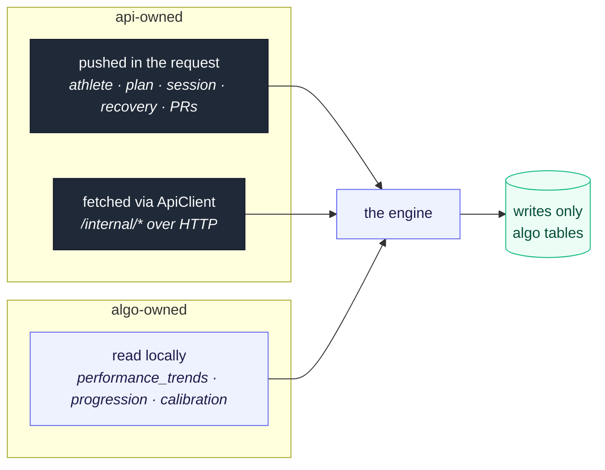
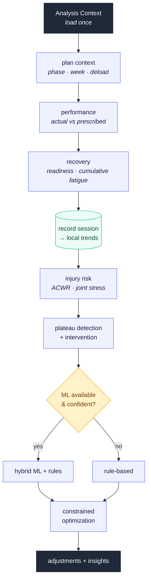
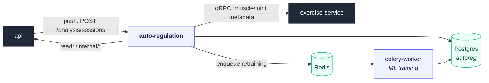
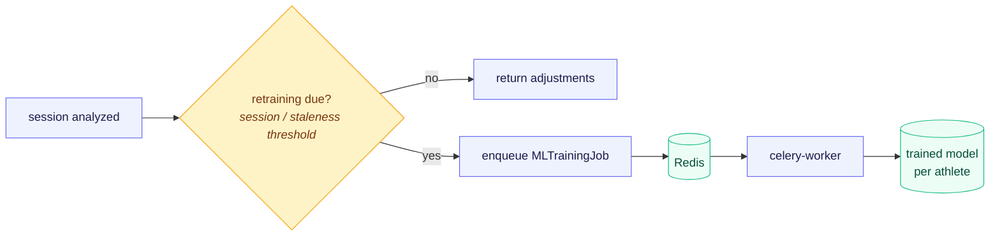

# auto-regulation-service

The **progressive-overload engine** for Athleta. It takes a completed workout and
answers one question: *what should next week look like?* — adjusting volume,
intensity, prescriptions, and intensity techniques from the athlete's
performance, recovery, fatigue, and injury risk. Built with FastAPI; rules and ML
working together.

The training science behind every number lives in
**[TRAINING_SCIENCE.md](TRAINING_SCIENCE.md)**. This README is about the
*software* — how the service is shaped and why.

---

## Why this exists

The hard part of autoregulation isn't any single formula; it's keeping a large,
evidence-based policy **testable and honest** while it reaches across an athlete's
whole history. Two design choices make that possible.

### 1. It owns *algorithm state*, not the athlete

api is the source of truth for the user and workout domain (athletes, plans,
logged sessions, sets, recovery, PRs). This service is a **stateless computation
engine**: it never maps those tables. Its own database (`autoreg`, schema
`ai_analysis`) holds *only the state the algorithm itself produces* — denormalized
trends, progression state machines, calibration factors. api-owned data arrives
two ways, never as a shared table:



References to api rows (`athlete_id`, `exercise_id`, `workout_day_id`, …) are
**soft integer references** — there are no cross-service foreign keys.

## What it does

A completed workout flows through the engine and comes out as next-workout
adjustments plus write-backs for api to persist
([progressive_overload_engine.py](app/modules/progression/progressive_overload_engine.py)):



Around that core the completion endpoint also detects PRs, recomputes the RPE
calibration factor, updates the current plan week, generates the next workout, and
(if due) queues ML retraining — committing everything in one transaction,
**idempotently by session id**.

---

## Architecture

### Where it sits



### Vertical modules

The service is organized by **domain capability**, not by technical layer — each
module is a vertical slice that exposes a small facade and hides its internals.
Cross-module needs go through the facade (its `__init__.py`), never into private
submodules.

| Module | Responsibility |
| --- | --- |
| `modules/analysis` | The **Analysis Context** seam: load-once, immutable input the engine computes over (plus the ML training-history window). |
| `modules/progression` | The **orchestrator**: `ProgressiveOverloadEngine`, load/rep progression, PR detection, plateau intervention, scheduling, plan updates. |
| `modules/prescription` | Target RPE/RIR/rest generation, intensity-technique selection (drop sets, myo-reps, …), warm-up sets. |
| `modules/periodization` | Periodization-model selection and plan-duration recommendation (linear / undulating / block). |
| `modules/volume` | Volume landmarks (MEV/MAV/MRV) and recovery/readiness modeling. |
| `modules/injury` | Weighted joint-stress profiling and injury-aware exercise substitution. |
| `modules/rpe` | Per-athlete RPE-accuracy calibration. |
| `modules/form` | Form-quality tracking; gates progression when form degrades. |
| `modules/ml` | Workout-parameter prediction: Bayesian LightGBM ensemble, optional sequential CNN, feature engineering, async retraining. |

### The data it owns (Postgres `autoreg`)

Every model maps onto `AutoregBase`; api-owned data is **not** mapped here
([models/](app/models/__init__.py)).

| Table | Holds |
| --- | --- |
| `performance_trends` | One denormalized row per completed session (performance, readiness, volume, RPE, **ACWR**) — the local history the engine reads. |
| `plan_entries` | Per-week plan instance: phase, week, deload flag, target multipliers, applied AI adjustments. |
| `exercise_progression_tracking` | Per-exercise double-progression state (familiarity, rep vs weight phase). |
| `form_quality_trends` | Per-exercise form-degradation trend. |
| `athlete_rpe_calibration` | Per-athlete/exercise RPE-accuracy factor. |
| `muscle_volume_log` | Weekly sets per muscle group (volume-landmark tracking). |
| `joint_stress_log` | Weighted joint stress (injury profile). |
| `workout_prescription_history` | Pre-computed prescriptions for upcoming workouts. |
| `ml_training_jobs` | Async retraining job status. |

### Hybrid intelligence + async retraining

Predictions are **rules-first with ML on top**, weighted by the model's
confidence *and* its uncertainty — so the system is never overconfident on thin
data (see [TRAINING_SCIENCE.md](TRAINING_SCIENCE.md#machine-learning-integration)).
Model *training* is CPU-bound, so it never runs on the request path: the
completion endpoint enqueues a job on Redis and a **Celery worker** retrains in
the background.



### Seams (the boundaries that keep it testable)

- **`ApiClient`** ([clients/api_client.py](app/clients/api_client.py)) — a
  context-managed HTTP client for api-owned data. Tests patch its methods to an
  in-memory fake, so the engine runs with no api running.
- **`ExerciseClient`** ([clients/exercise_client.py](app/clients/exercise_client.py))
  — the gRPC client to exercise-service for muscle/joint metadata and
  substitution candidates.
- **The Analysis Context** — the engine depends on an immutable dataclass, not on
  a session or a request, so its policy is a pure function under test.

---

## HTTP API

Interactive docs at `/docs` (Swagger) and `/redoc` once running.

| Endpoint | Purpose |
| --- | --- |
| `POST /api/analysis/sessions` | **The core flow.** Analyze a pushed completed workout; return adjustments + write-backs (PRs, calibration). Idempotent by session id. |
| `GET /api/athletes/{id}/analytics` | Progression analytics from local trends (ACWR, readiness, deload history). |
| `POST /api/prescriptions/generate` | Target RPE/RIR/rest for one exercise, given goal/phase/week. |
| `POST /api/prescriptions/generate-batch` | The same for many exercises at once. |
| `POST /api/plan/recommend-config` | Recommend a periodization model + plan duration. |
| `GET /api/injury-prevention/athlete/{id}/joint-stress-profile` | Joints to spare, from weighted recent joint stress. |
| `POST /api/ml/train/{athlete_id}` | Queue async ML retraining. |
| `GET /api/ml/jobs` · `GET /api/ml/jobs/{job_id}` | Retraining job status. |

---

## Running

### Prerequisites

- Python 3.11+ (`<3.14`)
- The `autoreg` Postgres (`docker compose up autoreg-db` from the repo root)
- Redis for async ML retraining; a reachable api and exercise-service for the
  full completion flow
- [uv](https://docs.astral.sh/uv/) for dependency management

### Setup

```bash
uv sync --all-extras           # app + dev + ml (lightgbm)
source .venv/bin/activate       # .venv\Scripts\activate on Windows
# configure your environment (see the table below), then:
alembic upgrade head            # apply migrations to $AUTOREG_DATABASE_URL
uvicorn app.main:app --reload   # http://localhost:8000  (docs at /docs)
```

ML libraries are an optional extra — the service runs without them and simply
disables ML predictions, falling back to rules.

### Configuration (environment)

| Var | Default | Notes |
| --- | --- | --- |
| `AUTOREG_DATABASE_URL` | — | This service's own `autoreg` database |
| `API_BASE_URL` | `http://localhost:8080` | api base URL for `/internal/*` reads |
| `SERVICE_TOKEN` | — | shared service-to-service token |
| `EXERCISE_SERVICE_ADDR` | `localhost:50051` | exercise-service gRPC address |
| `REDIS_URL` | `redis://localhost:6379/0` | Celery broker/backend |
| `RETRAINING_SESSION_THRESHOLD` | `20` | sessions between retrains (~1 mesocycle) |

To run the background worker:

```bash
celery -A app.celery_app worker --loglevel=info -Q ml_training
```

### Code quality

```bash
black app/    # format
ruff check app/  # lint
mypy app/     # type-check
```

---

## Testing

Tests are split by cost — fast calculation/algorithm units, integration journeys,
and heavy ML tests that run nightly. The full strategy (markers, fixtures, what
runs on each CI stage) is documented in **[tests/README.md](tests/README.md)**.

```bash
pytest -m "not ml"   # everything except the nightly ML suite
pytest -m smoke      # the critical completion-endpoint path
```

Because the engine computes over the Analysis Context, the integration suite
patches `ApiClient`/`ExerciseClient` to in-memory fakes and drives real user
journeys with no other service running.

---

## Project layout

```text
auto-regulation-service/
├── app/
│   ├── main.py              # FastAPI app: routers, CORS, startup checks
│   ├── config.py            # env-driven settings
│   ├── celery_app.py        # Celery config for async ML training
│   ├── database.py          # SQLAlchemy session for the autoreg DB
│   ├── clients/             # ApiClient (HTTP) + ExerciseClient (gRPC) seams
│   ├── modules/             # vertical slices (see the table above)
│   │   ├── analysis/        # the Analysis Context seam
│   │   ├── progression/     # the ProgressiveOverloadEngine + orchestration
│   │   ├── prescription/    # RPE/RIR/rest + intensity techniques
│   │   ├── periodization/   # periodization model selection
│   │   ├── volume/          # MEV/MAV/MRV + recovery modeling
│   │   ├── injury/          # joint-stress profiling + substitution
│   │   ├── rpe/             # RPE calibration
│   │   ├── form/            # form-quality gates
│   │   └── ml/              # prediction + async retraining
│   ├── models/              # SQLAlchemy models — algo state only
│   ├── shared/              # pure training calculations (1RM, RPE, …)
│   └── utils/               # constants + helpers
├── alembic/                 # migrations
├── tests/                   # see tests/README.md
├── TRAINING_SCIENCE.md      # the evidence base behind every number
└── pyproject.toml
```
