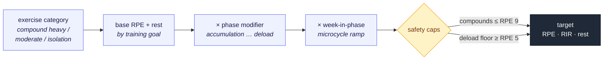
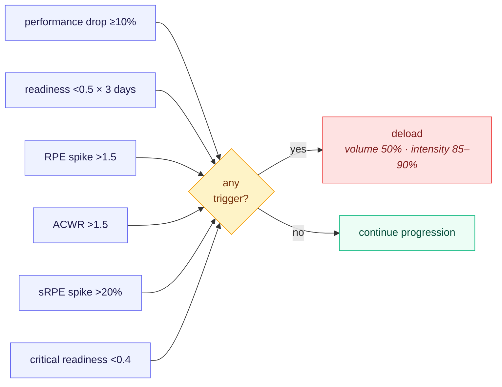
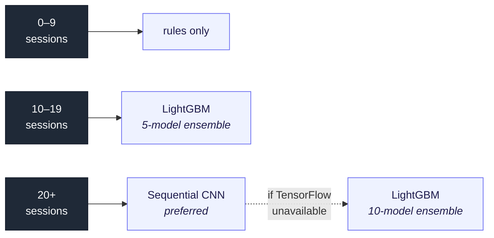

# Training Science

The evidence base behind every number the **auto-regulation-service** produces.
Each section states the principle, the supporting research, and exactly how it is
implemented — so a prescription, a deload trigger, or a volume target can always
be traced back to *why*.

> This is the **science** reference. For how the service is *built* — modules,
> seams, data ownership — see the [README](README.md).

---

## How the science maps to the code

Each topic is implemented by one vertical module under
[`app/modules/`](app/modules/):

| Science | Module |
| --- | --- |
| Progressive Overload · Exercise-Specific Progression | `progression` |
| Prescription Generation · Intensity Techniques | `prescription` |
| Volume Landmarks (MEV/MAV/MRV) | `volume` |
| Autoregulated Deloads (ACWR · sRPE) | `volume` · `injury` |
| Periodization Models | `periodization` |
| Gender & Age Adjustments | cross-cutting (`volume` · `progression`) |
| RPE Calibration | `rpe` |
| Machine Learning Integration | `ml` |

---

## Contents

| Part | Sections |
| --- | --- |
| **I · The Progression Engine** | [Progressive Overload](#progressive-overload) · [Prescription Generation](#prescription-generation) |
| **II · Individualization** | [Gender & Age Adjustments](#gender--age-based-adjustments) · [Exercise-Specific Progression](#exercise-specific-progression) |
| **III · Shaping the Stimulus** | [Intensity Techniques](#intensity-techniques) · [Volume Landmarks](#volume-landmarks-mev-mav-and-mrv) |
| **IV · Fatigue & Structure** | [Autoregulated Deloads](#autoregulated-deloads) · [Periodization Models](#periodization-models) |
| **V · Learning the Athlete** | [RPE Calibration](#rpe-calibration) · [Machine Learning Integration](#machine-learning-integration) |

[Scientific References](#scientific-references)

---

## Part I · The Progression Engine

## Progressive Overload

### Principle

Progressive overload is the gradual increase of stress placed on the body during training. It's the fundamental principle for strength and hypertrophy gains.

### Implementation

- **Volume Progression**: Increase sets/reps over time
- **Intensity Progression**: Increase load (weight) over time
- **Frequency Progression**: Increase training frequency
- **Density Progression**: Decrease rest periods

### Experience-Based Rates

| Experience Level | Load Increase/Session | Volume Increase/Week |
| ---------------- | --------------------- | -------------------- |
| Beginner         | 5%                    | 10%                  |
| Intermediate     | 2.5%                  | 5%                   |
| Advanced         | 1%                    | 2.5%                 |

**References:**

- NSCA Guidelines (2008)
- Schoenfeld et al. (2017): Volume landmarks for hypertrophy

---

## Prescription Generation

### Overview

The system automatically generates scientifically-validated training prescriptions for target RPE, RIR, and rest periods based on exercise characteristics, training goals, and training phase.



### Exercise Intensity Categories

Exercises are categorized by CNS (Central Nervous System) demand:

| Category              | Examples                                       | CNS Demand |
| --------------------- | ---------------------------------------------- | ---------- |
| **Compound Heavy**    | Squats, Deadlifts, Bench Press                 | Very High  |
| **Compound Moderate** | Rows, Lunges, Overhead Press                   | Moderate   |
| **Isolation**         | Bicep Curls, Tricep Extensions, Lateral Raises | Low        |

This categorization is stored in the database (`intensity_category` column) to avoid brittle string matching.

### Base Prescription Ranges

#### Strength Training

| Exercise Category | RPE Range | Rest Period |
| ----------------- | --------- | ----------- |
| Compound Heavy    | 7.0 - 8.0 | 180 - 300s  |
| Compound Moderate | 7.0 - 9.0 | 150 - 240s  |
| Isolation         | 8.0 - 9.0 | 90 - 120s   |

#### Hypertrophy Training

| Exercise Category | RPE Range  | Rest Period |
| ----------------- | ---------- | ----------- |
| Compound Heavy    | 7.0 - 8.0  | 120 - 180s  |
| Compound Moderate | 7.0 - 9.0  | 90 - 150s   |
| Isolation         | 8.0 - 10.0 | 60 - 90s    |

#### Hybrid Training

Hybrid training uses **context-aware routing** rather than averaging:

| Exercise Category | Follows     | RPE Range  | Rest Period |
| ----------------- | ----------- | ---------- | ----------- |
| Compound Heavy    | Strength    | 7.0 - 8.0  | 180 - 300s  |
| Compound Moderate | Strength    | 7.0 - 9.0  | 150 - 240s  |
| Isolation         | Hypertrophy | 8.0 - 10.0 | 60 - 90s    |

**Rationale**: Compounds build strength (need CNS recovery), isolations maximize metabolic stress for growth.

### Phase Modifiers

| Phase           | RPE Modifier | Rest Modifier | Rationale                              |
| --------------- | ------------ | ------------- | -------------------------------------- |
| Accumulation    | -0.5         | 0.9x          | High volume, moderate intensity        |
| Intensification | +0.5         | 1.0x          | Building toward peak                   |
| Realization     | +1.0         | 1.1x          | Peaking (capped at 9.0 for compounds)  |
| **Deload**      | **-2.0**     | **0.75x**     | **Active recovery, injury prevention** |

**Deload Safety**: The deload phase aggressively reduces intensity to prevent injury and allow recovery. RPE never drops below 5.0 to maintain training stimulus.

### Microcycle Progression

Within each phase, difficulty increases week-by-week:

| Week | RPE Modifier | Rationale     |
| ---- | ------------ | ------------- |
| 1    | -0.5         | Ramp-up week  |
| 2    | 0.0          | Baseline      |
| 3    | +0.25        | Building      |
| 4+   | +0.5         | Peak of phase |

This ensures Week 4 is harder than Week 1, even within the same phase, implementing progressive overload.

### Safety Rules

#### CNS Tax Rule

**All compound exercises are capped at RPE 9.0 maximum**, regardless of training phase or week. This prevents form breakdown and injury risk from excessive CNS fatigue.

**Rationale**: Heavy compound movements place significant stress on the central nervous system. Training at RPE 10 (true failure) on compounds increases injury risk and reduces training quality.

#### Inverse RPE/RIR Law

**Strictly enforced**: `RIR = 10 - RPE`

This relationship must always hold. The system calculates RIR directly from RPE to ensure consistency.

**Example**:

- RPE 8.0 → RIR 2
- RPE 9.5 → RIR 0 (or 1, depending on rounding)
- RPE 7.0 → RIR 3

#### Deload Floor

During deload phases, RPE never drops below 5.0. This maintains a minimal training stimulus while allowing recovery.

### Implementation

```python
# Example: Generate prescription for compound heavy exercise in hybrid training
prescription = service.generate_prescription(
    intensity_category=ExerciseIntensityCategory.COMPOUND_HEAVY,
    training_type=TrainingType.HYBRID,
    training_phase="accumulation",
    week_in_phase=2,
    is_primary=True
)

# Result:
# {
#   "target_rpe": 7.5,  # Base 8.0 - 0.5 (accumulation) + 0.0 (week 2)
#   "target_rir": 2,    # 10 - 7.5 = 2.5 → rounded to 2
#   "rest_period_seconds": 270  # Strength rest (180-300s), primary = max, phase = 0.9x
# }
```

### Scientific References

- **Zourdos et al. (2016)**: Novel Resistance Training-Specific Rating of Perceived Exertion Scale
- **Schoenfeld et al. (2016)**: Effects of rest interval length on training adaptations
- **Grgic et al. (2018)**: Rest interval between sets in resistance training: A systematic review

---

## Part II · Individualization

## Gender & Age-Based Adjustments

### Gender Differences

#### Women vs Men

**Recovery & Fatigue Resistance:**

- Women show ~8% greater fatigue resistance in submaximal work
- Less muscle damage from eccentric loading
- Superior recovery between high-volume sets
- **Important**: Individual variability within genders often exceeds between-gender differences

**Physiological Basis:**

- Enhanced oxidative metabolism
- Greater proportion of Type I muscle fibers on average
- Different hormonal response to training stress
- More efficient intramuscular coordination under fatigue

**Implementation:**

```python
GENDER_RECOVERY_MODIFIERS = {
    Gender.MALE: 1.0,     # Baseline
    Gender.FEMALE: 1.08,  # 8% fatigue resistance advantage
}
```

**Note on Individual Variation:**
The system applies these modifiers as starting points, but individual athlete responses always take priority. Many female athletes may not show this advantage, and some male athletes may have superior fatigue resistance.

**References:**

- Kraemer et al. (2001): Gender differences in recovery
- Hunter (2014): Sex differences in human fatigability
- Temesi et al. (2015): Are females more resistant to extreme neuromuscular fatigue?

### Age-Based Progression with Training Age Consideration

#### Updated Age Brackets & Modifiers

| Age Range | Base Modifier | Rationale                                |
| --------- | ------------- | ---------------------------------------- |
| 18-25     | 1.10 (110%)   | Peak recovery, optimal protein synthesis |
| 26-35     | 1.0 (100%)    | Baseline performance                     |
| 36-45     | 0.85 (85%)    | Reduced recovery capacity                |
| 46-55     | 0.75 (75%)    | Masters athlete adjustments              |
| 56-65     | 0.70 (70%)    | Longer recovery needed                   |
| 66+       | 0.65 (65%)    | Senior masters adjustments               |

**Training Age vs Chronological Age:**

The system now distinguishes between chronological age and training age (years of consistent training experience). Well-trained older athletes can offset age-related decline:

- **10+ years training**: Offset up to 20% of age penalty
- **5-9 years training**: Offset up to 10% of age penalty
- **<5 years training**: Standard age modifiers apply

**Example:**

- 50-year-old novice: 0.75 modifier
- 50-year-old with 15 years training: ~0.80 modifier (reduced penalty)

**Physiological Basis:**

- Trained athletes maintain higher satellite cell activity
- Better neuromuscular efficiency
- Preserved muscle quality and motor unit recruitment
- Maintained protein synthesis response to training

**References:**

- Schoenfeld et al. (2016): Effects of age on muscle hypertrophy
- Ahtiainen et al. (2016): Training adaptations across age groups
- Tanaka & Seals (2008): Endurance exercise performance in Masters athletes

---

## Exercise-Specific Progression

### Compound vs Isolation Exercises

#### Compound Exercises

- **Examples**: Squat, deadlift, bench press, rows
- **Progression Rate**: 1-3% per session
- **Rationale**: Higher CNS fatigue, more technical complexity

#### Isolation Exercises

- **Examples**: Bicep curls, leg extensions, tricep extensions
- **Progression Rate**: 3-6% per session
- **Rationale**: Lower systemic fatigue, simpler movement patterns

### Exercise Familiarity

**New Exercises:**

- First 4-6 weeks: 1% progression regardless of type
- Allows motor pattern learning
- Prevents injury from unfamiliar movements

**Familiarity Score:**

- Starts at 0.0 (completely new)
- Increases by 0.1 per session
- Considered "familiar" at 0.6+

### Double Progression for Hypertrophy

**Concept**: Progress reps first, then weight

**Steps:**

1. **Rep Progression Phase**

   - Start at minimum reps (e.g., 6)
   - Add 1 rep per session
   - Continue until max reps reached (e.g., 12)

2. **Weight Progression Phase**
   - Increase weight by 5%
   - Reset to minimum reps
   - Begin rep progression again

**Example:**

```
Week 1: 100kg × 6 reps × 3 sets
Week 2: 100kg × 7 reps × 3 sets
Week 3: 100kg × 8 reps × 3 sets
...
Week 7: 100kg × 12 reps × 3 sets
Week 8: 105kg × 6 reps × 3 sets (weight increased, reps reset)
```

**References:**

- Krieger (2010): Volume and hypertrophy dose-response
- Schoenfeld (2010): Mechanisms of hypertrophy

---

## Part III · Shaping the Stimulus

## Intensity Techniques

### Overview

Intensity techniques are advanced training methods that modify how sets or reps are performed to increase training stimulus without adding more volume. The AI engine uses a **trigger-based system** to automatically recommend techniques only when needed.

### Two Categories: Set Types & Rep Styles

The system uses two composable categories that can be combined:

#### Set Types (How the set is structured)

| Set Type                | Description                              | Best For             | Min. Experience |
| ----------------------- | ---------------------------------------- | -------------------- | --------------- |
| **STRAIGHT**            | Standard sets (default)                  | All goals            | Beginner        |
| **DROP_SET**            | Reduce weight 20%, continue reps         | Hypertrophy          | Intermediate    |
| **REST_PAUSE**          | 15-20s rest, continue to failure         | Hypertrophy/Strength | Intermediate    |
| **MYO_REPS**            | Activation set + mini-sets (3-5 reps)    | Hypertrophy          | Intermediate    |
| **CLUSTER_SET**         | Intra-set rest (15-30s between clusters) | Strength             | Advanced        |
| **SUPERSET_ANTAGONIST** | Paired with antagonist exercise          | Time efficiency      | Beginner        |
| **PRE_EXHAUST**         | Isolation before compound                | Hypertrophy          | Intermediate    |

#### Rep Styles (How individual reps are performed)

| Rep Style               | Description                         | Best For    | Min. Experience |
| ----------------------- | ----------------------------------- | ----------- | --------------- |
| **NORMAL**              | Standard full ROM reps (default)    | All goals   | Beginner        |
| **LENGTHENED_PARTIALS** | Partials in stretched position      | Hypertrophy | Intermediate    |
| **TEMPO_ECCENTRIC**     | Slow eccentric (3-5 seconds)        | Hypertrophy | Beginner        |
| **TEMPO_PAUSED**        | 1-2 sec pause at stretched position | Hypertrophy | Beginner        |
| **ECCENTRIC_OVERLOAD**  | Supramaximal eccentric loading      | Strength    | Advanced        |

### Composability

Set types and rep styles can be combined for targeted effects:

```
Cluster Set + Tempo Eccentric → Strength-hypertrophy hybrid
Drop Set + Lengthened Partials → Maximum hypertrophy stimulus
Myo-Reps + Normal → Time-efficient hypertrophy
Straight Set + Tempo Paused → Beginner-friendly technique exposure
```

**Invalid Combinations:**

- Myo-Reps only work with Normal rep style (requires fast execution)
- Eccentric Overload doesn't combine with Drop Sets (safety)

### Trigger-Based Automatic Recommendation

The AI **defaults to straight sets with normal tempo** and only recommends intensity techniques when specific triggers are detected:

#### 1. Plateau Detection

- Performance stalled for 2-3 consecutive sessions
- No weight or rep increase despite consistent effort
- **Response**: Drop sets, myo-reps, or rest-pause to break through

#### 2. Struggling Performance

- High RPE (8+) with no progression
- Athlete putting in effort but not advancing
- **Response**: Technique to maximize stimulus from existing load

#### 3. Volume Ceiling

- Athlete at 90%+ of MRV for a muscle group
- Can't add more sets without overtraining
- **Response**: Myo-reps or drop sets to increase stimulus without more sets

#### 4. Phase-Based

- Late accumulation phase (week 3-4 of mesocycle)
- Optimal time to push intensity before deload
- **Response**: Appropriate technique based on training type

### Implementation

```python
# Only recommend technique if triggers detected
if not triggers["any_triggered"]:
    return SetType.STRAIGHT, RepStyle.NORMAL

# Select based on which trigger fired
if triggers["plateau_detected"]:
    if exercise_type == ISOLATION:
        return SetType.DROP_SET or SetType.MYO_REPS
    else:
        return SetType.REST_PAUSE or SetType.CLUSTER_SET

if triggers["volume_ceiling_detected"]:
    return SetType.MYO_REPS  # More stimulus, no extra sets
```

### Fatigue & Volume Impact

Each technique has multipliers that affect fatigue calculations:

| Technique           | Volume Multiplier | Fatigue Multiplier |
| ------------------- | ----------------- | ------------------ |
| Drop Set            | 1.3×              | 1.2×               |
| Myo-Reps            | 1.4×              | 1.1×               |
| Rest-Pause          | 1.25×             | 1.15×              |
| Cluster Set         | 1.0×              | 0.9×               |
| Tempo Eccentric     | 1.1×              | 1.15×              |
| Lengthened Partials | 1.15×             | 1.1×               |

These multipliers are used to:

- Adjust volume calculations for weekly tracking
- Factor into fatigue accumulation and deload triggers
- Inform recovery recommendations

### Scientific Basis

**Drop Sets:**

- Schoenfeld et al. (2018): Drop sets produce similar hypertrophy to traditional sets with less time
- Effective for metabolic stress and muscle fiber recruitment

**Rest-Pause / Myo-Reps:**

- Prestes et al. (2019): Rest-pause produces comparable strength gains with time efficiency
- Borges et al. (2017): Effective for increasing training volume within time constraints

**Cluster Sets:**

- Haff et al. (2003): Maintains power output and movement quality
- Ideal for strength/power development with reduced fatigue

**Lengthened Partials:**

- Pedrosa et al. (2023): Training at long muscle lengths produces superior hypertrophy
- Stretched position provides greater mechanical tension

**Tempo Manipulation:**

- Schoenfeld et al. (2015): Time under tension contributes to hypertrophy
- Slow eccentrics increase muscle damage and mechanical tension

---

## Volume Landmarks: MEV, MAV, and MRV

### The Volume Dose-Response Curve

Training volume (sets per muscle group per week) follows a dose-response relationship with muscle growth. The system tracks three critical landmarks:


For hypertrophy training the engine blends performance-based adjustments with an
athlete's position on this curve (70% performance, 30% volume landmarks).

### Key Volume Thresholds

**MEV (Minimum Effective Volume)**

- The minimum weekly volume needed to stimulate growth
- Below this threshold: maintenance at best
- Typically: 8-10 sets/muscle/week for most individuals

**MAV (Maximum Adaptive Volume)**

- The optimal volume range for growth
- "Sweet spot" where stimulus and fatigue are balanced
- Typically: 12-18 sets/muscle/week

**MRV (Maximum Recoverable Volume)**

- The maximum volume you can recover from
- Beyond this: diminishing returns, excessive fatigue
- Typically: 20-25 sets/muscle/week

### Individual Variation Factors

Volume landmarks vary significantly based on:

1. **Training Experience**

   - Beginners: Lower thresholds (MEV: 6-8 sets)
   - Advanced: Higher thresholds (MEV: 10-12 sets)
   - Trained athletes can handle and benefit from more volume

2. **Muscle Group Size**

   - Large muscles (back, quads): Higher volume capacity
   - Small muscles (biceps, calves): Lower volume tolerance
   - Adjusted by 15-20% based on muscle size

3. **Age**

   - Younger athletes: Higher MRV
   - Masters athletes (40+): More conservative thresholds
   - Recovery capacity affects upper limits

4. **Recovery Status**
   - Sleep, nutrition, stress impact volume tolerance
   - System adjusts recommendations based on current state

### Implementation in AI Engine

The system uses volume landmarks to:

1. **Prevent Undertraining**

   - Alert if volume drops below MEV
   - Recommend volume increase: 10-15%

2. **Optimize Growth**

   - Guide athletes toward MAV range
   - Maintain moderate recommendations when in optimal zone

3. **Prevent Overtraining**
   - Warn when approaching MRV
   - Recommend volume reduction: 15-20%
   - Integrate with deload triggers

### Integration with Hypertrophy Training

For hypertrophy-focused training, the system:

- Tracks weekly sets per muscle group
- Calculates current position relative to landmarks
- Influences volume multiplier recommendations
- Blends with performance-based adjustments (70% performance, 30% volume landmarks)

**Example Volume Recommendations:**

```python
# Below MEV
Position: 6 sets/week (MEV: 8)
Recommendation: Increase volume by 15%
Priority: High

# In MAV range
Position: 14 sets/week (MAV: 12-18)
Recommendation: Maintain or slight increase (5%)
Priority: Moderate

# Near MRV
Position: 22 sets/week (MRV: 20)
Recommendation: Reduce volume by 15%
Priority: High
```

**References:**

- Schoenfeld et al. (2017): Dose-response relationship between volume and hypertrophy
- Israetel et al. (2018): Renaissance Periodization volume landmarks
- Baz-Valle et al. (2022): Systematic review of training volume for hypertrophy

---

## Part IV · Fatigue & Structure

## Autoregulated Deloads

### Traditional vs Autoregulated

**Traditional Deloads:**

- Fixed every 4 weeks
- Ignores individual recovery capacity
- May be too early or too late

**Autoregulated Deloads:**

- Based on performance and recovery metrics
- Individualized timing
- Prevents overtraining and undertraining

### Deload Triggers

System monitors these indicators — **any one** is enough to trigger a deload
(safety-first):



1. **Performance Drop**

   - ≥10% decrease over last 2 sessions
   - Indicates accumulated fatigue
   - Most direct indicator of overreaching

2. **Readiness Score**

   - <0.5 for 3+ consecutive days
   - Combines sleep, soreness, stress, and energy
   - Holistic recovery assessment

3. **RPE Spike**

   - RPE increase >1.5 points at same/lower volume
   - Suggests neuromuscular fatigue accumulation
   - Weight feels heavier than it should

4. **ACWR (Acute:Chronic Workload Ratio)**

   - Compares recent load (7 days) to long-term average (28 days)
   - **Safe zone**: 0.8 - 1.3
   - **Deload trigger**: >1.5 (spike in training load)
   - Calculated as: (volume/1000) × RPE
   - Evidence-based injury prevention metric

5. **Session RPE (sRPE) Spike**

   - sRPE = RPE × duration (minutes)
   - Measures total training load per session
   - **Trigger**: >20% increase over baseline
   - Detects cumulative fatigue from high training volume

6. **Critical Readiness**
   - Current readiness <0.4
   - Immediate concern requiring action
   - Overrides all other considerations

### ACWR Implementation Details

**Calculation:**

```python
Acute Load = Average daily load last 7 days
Chronic Load = Average daily load last 28 days
ACWR = Acute Load / Chronic Load

Load = (Total Volume / 1000) × Average RPE
```

**Interpretation:**

- **<0.8**: Undertraining, deconditioning risk
- **0.8-1.3**: Safe zone, optimal adaptation
- **1.3-1.5**: Elevated risk, monitor closely
- **>1.5**: High injury risk, deload recommended

**Why ACWR Works:**

- Balances fitness (chronic load) and fatigue (acute load)
- Too much spike = injury risk
- Too little load = deconditioning
- "Sweet spot" allows progressive overload with safety

### Session RPE (sRPE) Implementation

**Concept:**
Session RPE captures the total internal load of training by combining intensity (RPE) and volume (duration).

**Example:**

```
Session 1: RPE 7 × 60 min = 420 sRPE
Session 2: RPE 8.5 × 60 min = 510 sRPE
Increase: 21% → Triggers deload consideration
```

**Advantages:**

- Simple to calculate, no external equipment needed
- Correlates well with physiological stress
- Captures cumulative fatigue across exercises
- Useful when volume is high but intensity varies

### Deload Protocol

When triggered:

- **Volume**: Reduce to 50%
- **Intensity**: Reduce to 85-90%
- **Duration**: Typically 1 week
- **Purpose**: Dissipate fatigue while maintaining fitness

**Recovery Timeline:**

- Days 1-3: Fatigue dissipates rapidly
- Days 4-7: Fitness slightly decays, fatigue continues to reduce
- Result: Improved fitness-fatigue ratio

**References:**

- Zourdos et al. (2016): RPE-based autoregulation
- Mann et al. (2010): Autoregulatory progressive resistance
- Gabbett (2016): The training-injury prevention paradox (ACWR)
- Foster et al. (2001): Session RPE monitoring method

---

## Periodization Models

### 1. Linear Periodization

**Structure:**

- Start with high volume, low intensity
- Gradually increase intensity, decrease volume
- Classic beginner approach

**Best For:**

- Beginners
- Athletes with <2 sessions/week

### 2. Daily Undulating Periodization (DUP)

**Structure:**
Vary volume and intensity within the same week

**Example Week:**

- **Day 1 (Monday)**: High Volume Day
  - 10-12 reps @ 70% 1RM
  - 20% more sets than baseline
- **Day 2 (Wednesday)**: Moderate Day
  - 6-8 reps @ 80% 1RM
  - Normal set count
- **Day 3 (Friday)**: High Intensity Day
  - 3-5 reps @ 90% 1RM
  - 30% fewer sets

**Advantages:**

- Better for intermediate/advanced athletes
- More frequent exposure to different rep ranges
- Reduces monotony

**References:**

- Rhea et al. (2002): DUP produces greater strength gains than linear
- Zourdos et al. (2016): DUP with autoregulation

### 3. Block Periodization

**Structure:**
Sequential blocks focusing on specific adaptations

**Block 1: Accumulation (3-4 weeks)**

- Focus: High volume
- Volume: 120% of baseline
- Intensity: 75% of peak
- Goal: Build work capacity

**Block 2: Intensification (2-3 weeks)**

- Focus: Strength building
- Volume: 85% of baseline
- Intensity: 110% of baseline
- Goal: Convert volume to strength

**Block 3: Realization (1-2 weeks)**

- Focus: Peak performance
- Volume: 60% of baseline
- Intensity: 115% of baseline
- Goal: Demonstrate maximum strength

**References:**

- Issurin (2010): Block periodization for sports training
- Kiely (2012): Periodization theory

---

## Part V · Learning the Athlete

## RPE Calibration

### The RPE-RIR Relationship

**RPE (Rate of Perceived Exertion)**: How hard the set feels (1-10 scale)

**RIR (Reps in Reserve)**: How many more reps you could do

**Standard Conversion:**
| RPE | RIR |
|------|-----|
| 10 | 0 |
| 9.5 | 0 |
| 9 | 1 |
| 8.5 | 1 |
| 8 | 2 |
| 7.5 | 2 |
| 7 | 3 |

### Individual Calibration

**Problem**: Athletes vary in RPE perception accuracy

**Solution**: Track actual vs reported difficulty

**Calibration Process:**

1. **Data Collection**

   - Athlete reports RPE
   - Track actual reps achieved
   - Record proximity to failure

2. **Pattern Recognition**

   - Calculate athlete's RPE bias
   - Some underestimate difficulty (report lower RPE)
   - Some overestimate difficulty (report higher RPE)

3. **Adjustment**
   - Apply calibration factor
   - Factor >1.0 = underestimates
   - Factor <1.0 = overestimates

### Hybrid Rule-Based + ML Approach

**Phase 1: Rule-Based (0-30 sessions)**

- Use standard RPE-to-RIR conversion
- Track athlete's accuracy
- Calculate calibration factor

**Phase 2: ML Enhancement (30+ sessions)**

- Train LightGBM model
- Features: RPE, weight, reps, interactions
- Target: Actual RIR
- Combine ML (70%) + Rules (30%)

**References:**

- Zourdos et al. (2016): RPE accuracy and autoregulation
- Helms et al. (2016): Application of RPE-based training

---

## Machine Learning Integration

### Hybrid Approach Philosophy

**Why Hybrid?**

- ML learns individual patterns
- Rules provide safety guardrails
- Best of both worlds
- Uncertainty-aware predictions prevent overconfidence

### Tiered Model Selection

The system uses a tiered approach based on available data:



More data unlocks a more capable model, but **rules are always the fallback** —
the system never depends on ML being available.

| Sessions       | Model Type     | Ensemble Size | Description                                                  |
| -------------- | -------------- | ------------- | ------------------------------------------------------------ |
| 0-9            | Rules Only     | N/A           | Pure rule-based predictions                                  |
| 10-19          | LightGBM       | 5 models      | Bayesian ensemble with 5 models                              |
| 20+            | Sequential CNN | 5 models      | Temporal modeling with 1D CNN (preferred)                    |
| 20+ (fallback) | LightGBM       | 10 models     | Bayesian ensemble with 10 models (if sequential unavailable) |

**Benefits of Tiered Approach:**

- Users see ML benefits after just 10 sessions (~2 weeks)
- Progressive improvement as more data accumulates
- Safety-first: rules always available as fallback

### Workout Parameter Prediction

**Model**: LightGBM with Bayesian Ensemble (Production Model)

**Why LightGBM?**

- 3-5x faster training than RandomForest
- Better accuracy on small datasets
- Lower memory usage
- Built-in regularization
- Production-ready for real-world deployment

**Features** (40+):

- Athlete demographics (age, gender, experience)
- Recent performance (last 5 sessions)
- Recovery metrics (sleep, soreness, stress)
- Training load (ACWR, monotony)
- Volume/intensity trends

**Targets**:

- Volume multiplier (0.7 - 1.3)
- Intensity multiplier (0.8 - 1.15)

**Training Requirements**:

- Minimum: 10 completed sessions (tiered approach)
- Optimal: 50+ sessions
- Retraining: Every 50 sessions or 90 days

**Real-Time Data Integration:**

- PerformanceTrend records are created immediately after workout completion
- The just-completed session is included in ML predictions for the next workout
- Eliminates one-session lag - predictions use the most current data available

**Bayesian Uncertainty Estimation:**

- Trains multiple models with different random seeds
- Uses ensemble variance as uncertainty measure
- Lower variance = higher confidence
- Enables adaptive weighting with rules

**Prediction Strategy** (Enhanced with Uncertainty):

| ML Confidence | Uncertainty | Weighting         | Reasoning                        |
| ------------- | ----------- | ----------------- | -------------------------------- |
| ≥0.7 (High)   | <0.1 (Low)  | 80% ML, 20% Rules | High confidence, low uncertainty |
| ≥0.5 (Med)    | <0.15 (Med) | 50% ML, 50% Rules | Balanced approach                |
| ≥0.3 (Low)    | <0.2 (Med)  | 30% ML, 70% Rules | Conservative with uncertainty    |
| <0.3 or >0.2  | Any         | 100% Rules        | Safety first                     |

### Temporal Modeling (Sequential CNN)

**Model**: 1D Convolutional Neural Network (Optional - Requires TensorFlow)

**Note**: Sequential CNN is an optional enhancement that requires TensorFlow and Python ≤3.12. If unavailable, the system automatically falls back to LightGBM with a 10-model ensemble.

**Architecture**:

- Conv1D(64, kernel_size=3) → Conv1D(32, kernel_size=3)
- GlobalMaxPooling1D
- Dense(16) → Dropout(0.3) → Dense(2)

**Why Sequential?**

- Captures workout-to-workout dynamics
- Learns fatigue accumulation patterns
- Models progressive overload progression
- Better handles periodization cycles

**Features per Timestep** (15-20):

- Volume, intensity, RPE, readiness, performance, fatigue
- Recovery metrics (sleep, soreness, stress, energy)
- Time features (days since start, day of week)
- Rolling statistics (3-session moving averages)

**Sequence Length**: 10-20 sessions

**Training Requirements**:

- Minimum: 20 sessions
- Optimal: 50+ sessions
- Uses early stopping on validation loss

### RPE Calibration ML

**Model**: LightGBM (upgraded from GradientBoosting)

**Features**:

- Reported RPE
- Weight used
- Reps completed
- RPE × Reps (interaction)

**Target**: Actual RIR

**Implementation**:

```python
# Weighted prediction
if ml_weight > 0:
    hybrid_rir = (ml_rir * ml_weight) + (rule_rir * (1 - ml_weight))
```

**ML Weight Progression**:

- 30 samples: 0% ML (pure rules)
- 40 samples: 35% ML, 65% rules
- 50+ samples: 70% ML, 30% rules

### Model Interpretability

**Feature Importance**: Track which factors matter most

LightGBM provides feature importance scores that can be accessed via API:

- Shows which features drive predictions
- Helps understand model decisions
- Useful for debugging and validation

**Example Rankings** (typical):

1. Recent readiness scores (35%)
2. Volume trend (20%)
3. Age/experience (15%)
4. Recovery metrics (15%)
5. RPE trends (10%)
6. Other (5%)

### Uncertainty Quantification

**Bayesian Ensemble Approach:**

- Trains multiple models (5-10) with different random seeds
- Calculates prediction variance across ensemble
- Lower variance = higher confidence
- Enables principled uncertainty estimation

**Uncertainty Thresholds:**

- <0.1: Low uncertainty (high confidence)
- 0.1-0.15: Moderate uncertainty
- > 0.15: High uncertainty (use rules)

**Benefits:**

- Know when predictions are reliable
- Adaptive weighting with rule-based system
- Prevents overconfident predictions
- Better safety margins

### API Endpoints

**Model Management:**

- `POST /api/ml/train/{athlete_id}` - Queue async ML model training
- `GET /api/ml/jobs/{job_id}` - Get training job status
- `GET /api/ml/jobs` - List training jobs

**References:**

- ML in sports: Claudino et al. (2019)
- Predictive modeling: Carey et al. (2018)
- LightGBM: Ke et al. (2017)
- Bayesian ensembles: Lakshminarayanan et al. (2017)

---

## Scientific References

### Progressive Overload & Training Principles

1. **NSCA (2008)**: Essentials of Strength Training and Conditioning
2. **Schoenfeld et al. (2017)**: "Dose-response relationship between weekly resistance training volume and increases in muscle mass"
3. **Krieger (2010)**: "Single vs multiple sets for hypertrophy"

### Gender & Age Differences

4. **Kraemer et al. (2001)**: "Gender differences in recovery from resistance training"
5. **Hunter (2014)**: "Sex differences in human fatigability"
6. **Temesi et al. (2015)**: "Are females more resistant to extreme neuromuscular fatigue?"
7. **Schoenfeld et al. (2016)**: "Effects of resistance training frequency"
8. **Ahtiainen et al. (2016)**: "Heterogeneity in resistance training-induced muscle strength"
9. **Tanaka & Seals (2008)**: "Endurance exercise performance in Masters athletes"

### Volume Landmarks & Hypertrophy

10. **Baz-Valle et al. (2022)**: "Systematic review of resistance training volume for hypertrophy"
11. **Israetel et al. (2018)**: "Scientific principles of hypertrophy training" (Renaissance Periodization)

### RPE & Autoregulation

12. **Zourdos et al. (2016)**: "Modified RPE scale for resistance exercise"
13. **Mann et al. (2010)**: "Effect of autoregulatory progressive resistance"
14. **Helms et al. (2016)**: "Application of the repetitions in reserve-based RPE scale"
15. **Foster et al. (2001)**: "A new approach to monitoring exercise training" (Session RPE)

### Periodization

16. **Rhea et al. (2002)**: "A comparison of linear and daily undulating periodization"
17. **Issurin (2010)**: "New horizons for the methodology of sports training"
18. **Kiely (2012)**: "Periodization paradigms in the 21st century"

### Injury Prevention & Load Monitoring

19. **Gabbett (2016)**: "The training-injury prevention paradox: should athletes be training smarter and harder?" (ACWR)
20. **Banister et al. (1991)**: "Modeling human performance in running"
21. **Hulin et al. (2016)**: "Spikes in acute workload are associated with increased injury risk"

### Machine Learning in Sports

22. **Claudino et al. (2019)**: "Current approaches to the use of AI for injury risk assessment"
23. **Carey et al. (2018)**: "Predictive modelling of training loads and injury in Australian football"

### Intensity Techniques

24. **Schoenfeld et al. (2018)**: "Effects of drop sets on muscular hypertrophy"
25. **Prestes et al. (2019)**: "Effects of rest-pause training on muscular strength and hypertrophy"
26. **Borges et al. (2017)**: "Rest-pause training for muscle hypertrophy"
27. **Haff et al. (2003)**: "Cluster training: A novel method for introducing training variability"
28. **Pedrosa et al. (2023)**: "Training at long muscle lengths induces greater hypertrophy"
29. **Schoenfeld et al. (2015)**: "Effect of repetition duration during resistance training on muscle hypertrophy"

---

## Design Principles

Five commitments tie all of the above together in code:

1. **Individualized** — adapts to each athlete's age, gender, experience, and training history.
2. **Evidence-based** — every number traces to peer-reviewed research (see [Scientific References](#scientific-references)).
3. **Autoregulated** — adjusts on measured performance and recovery, never a fixed calendar.
4. **Safety-first** — injury-prevention caps (CNS-tax ceiling, ACWR, form gates, deload floor) gate every recommendation.
5. **Hybrid intelligence** — rules are the guardrails; ML personalizes within them, weighted by its own confidence and uncertainty.

These are why the engine is built as a pure function over an immutable
[Analysis Context](README.md): the policy is large, but it stays testable,
traceable, and honest about what it does not yet know.
