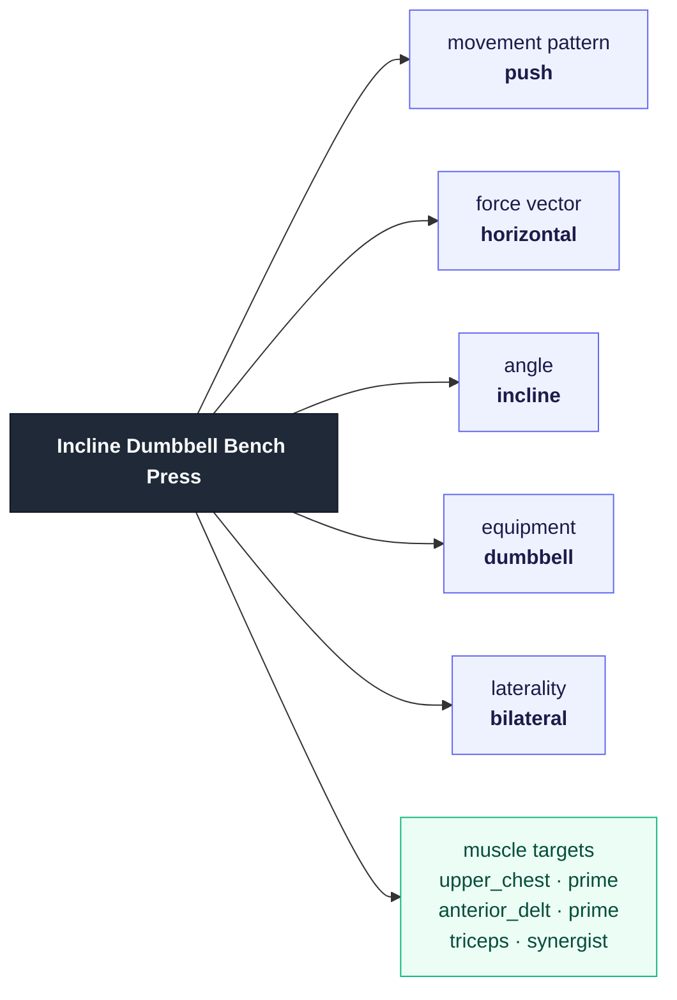
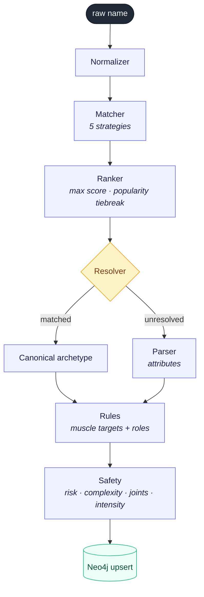
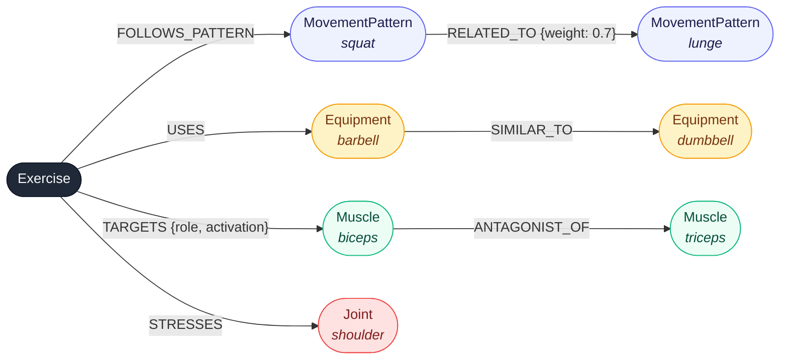
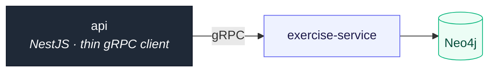

# exercise-service

The service that owns the **exercise domain** for Athleta. It turns free-form
exercise names ("incline db press", "i did some bench press") into structured,
attribute-composed exercises, persists them in a Neo4j graph, and answers
exercise-level queries (lookup, muscle metadata, substitution) over gRPC.

---

## Why this exists — the philosophy

Most fitness apps lean on a **flat, hand-curated exercise library**: a big table
of named exercises, each with its muscles, equipment, and metadata filled in by
hand or licensed from a vendor. We didn't have access to such a library, and
building (and maintaining) thousands of rows by hand was a non-starter.

So we inverted the problem. Instead of storing exercises as opaque named rows,
we model an exercise as a **composition of atomic attributes**:



Once an exercise is a *bundle of primitives* rather than a name, two things fall
out for free:

1. **We can infer an exercise we've never seen.** A name the service doesn't
   recognize is decomposed into its attributes and composed into a full
   biomechanical profile (muscles, injury risk, complexity, joint stress, CNS
   demand). The service **never fails on an unrecognized name** — it returns an
   *inferred* exercise instead.
2. **Relationships become queryable.** "Find me a substitute that hits the same
   prime mover but spares the shoulder" is a graph traversal, not a join against
   a column nobody maintained.

A small **curated vocabulary** (~48 common exercises in
[`config/exercises.json`](config/exercises.json)) gives us clean canonical names
and aliases for the lifts people actually type, so "bench press", "bb bench",
and "bech press" all resolve to the same archetype. Everything outside the
vocabulary is inferred from its attributes. The vocabulary is a *matching aid*,
not the source of truth — the graph is.

This is also why the old Postgres `exercises` / `exercise_muscles` /
`muscle_groups` tables were removed: the exercise domain lives here now, and the
rest of the system references exercises by integer ID through this service.

---

## What it does

A raw name flows through this pipeline:



- **Normalizer** strips conversational noise ("i just finished…"), lowercases,
  removes stop words, de-pluralizes.
- **Matcher** scores the name against the vocabulary with five strategies
  (exact, alias, token-set, Jaccard, phonetic/Soundex) and a ranker that takes
  the *max* weighted score per exercise, breaking ties by popularity.
- **Resolver** turns the matcher's four-valued result into a decision: a clear
  or popular-ambiguous match resolves to the canonical archetype; anything
  shakier is inferred.
- **Parser** decomposes the name into atomic attributes (equipment, laterality,
  angle, grip, tempo, force vector) and classifies the movement pattern.
- **Rules** derive muscle targets (with `prime_mover` / `synergist` /
  `stabilizer` roles) from the movement classification.
- **Safety** derives injury risk (1–3), complexity (0–1), stressed joints, and
  CNS-demand category (`compound_heavy` / `compound_moderate` / `isolation`).
- **Graph** persists the exercise and rebuilds its attribute relationships.

---

## Architecture

### The graph (Neo4j)

Neo4j is the source of truth, modeled so traversal is genuinely useful — not as
a key-value store with extra steps.

The same-label edges (`RELATED_TO`, `SIMILAR_TO`, `ANTAGONIST_OF`) connect two
*different* nodes of the same type — shown below with example instances:



Each node type earns its place by powering a query:

| Node | Why it's a node (not a property) |
|---|---|
| `MovementPattern` | `RELATED_TO` edges encode substitution affinity (squat↔lunge) as data, not a hard-coded table. |
| `Muscle` | "exercises sharing a prime mover" is a 2-hop traversal over `TARGETS`; size/recovery/antagonist metadata describes the muscle. |
| `Equipment` | `SIMILAR_TO` makes "same or interchangeable equipment" a traversal. |
| `Joint` | `STRESSES` turns athlete injury constraints into a graph filter. |

Per-exercise modifiers with no useful relationships (laterality, angle, grip,
tempo, force vector) are plain `Exercise` properties. Integer IDs are allocated
from a `Counter` node and are stable across re-inference (exercises `MERGE` by
name), so other services can reference them safely.

### Packages

The internals are split so that policy is testable without a database:

| Package | Responsibility |
|---|---|
| `internal/inference` | Pure functions: parser (name → attributes), rules (attributes → muscles), safety (attributes → risk/complexity/joints/intensity). |
| `internal/matcher` | Pure name scoring against the vocabulary (5 strategies + ranker). |
| `internal/resolver` | Name-resolution **policy** — interprets matcher results into "matched canonical" vs "infer". |
| `internal/service` | Orchestration: resolve → compose → persist; seeding; substitution scoring. Depends on the `Graph` **seam**, not on Neo4j. |
| `internal/graph` | The Neo4j **adapter** for `Graph`, plus the static taxonomy seed (`InitSchema`). |
| `internal/memgraph` | An in-memory **adapter** for `Graph`, used to unit-test orchestration with no database. |
| `internal/domain` | Shared types (`Exercise`, `Attributes`, `MuscleTarget`, `SubstitutionCandidate`, …). |
| `internal/config` | Loads + hot-reloads `exercises.json` and `scoring_weights.json`. |
| `internal/grpc` | The gRPC transport: proto ⇄ domain mapping, input validation. |
| `gen/exercise/v1` | Generated protobuf/gRPC stubs. |

Two design seams make the service deep and testable:

- **`service.Graph`** — the service talks to an interface; the Neo4j repository
  and the in-memory `memgraph` both satisfy it. Orchestration is unit-tested in
  milliseconds against `memgraph`; the Neo4j adapter is pinned by integration
  tests.
- **Substitution scoring** — the graph returns raw *structural facts*
  (same/related pattern, same/similar equipment); all weighting lives in one
  place (`service/scoring.go`), not smeared into a Cypher string.

### Where it sits



The `api` keeps only a thin gRPC client. Workout-level concerns (which exercise
is "primary", how it fits a plan) stay in `api`; the exercise domain lives here.

---

## gRPC API

Service `exercise.v1.ExerciseService`
([`proto/exercise/v1/exercise.proto`](../../proto/exercise/v1/exercise.proto)):

| RPC | Purpose |
|---|---|
| `InferExercises([]name) → []InferredExercise` | Resolve raw names into structured, persisted exercises. One result per name, in order; each carries a resolution kind (`MATCHED`/`INFERRED`) and confidence. Never errors on an unrecognizable name (blank names are rejected as `InvalidArgument`). |
| `GetExercises([]id) → []Exercise` | Hydrate exercises by ID. Unknown IDs are omitted, not an error. |
| `FindSubstitutions(id, excludeJoints, excludeIds, limit) → []Substitution` | Scored replacements (muscle-activation overlap blended with structural similarity), ordered by score. Joint/ID exclusions let callers inject athlete constraints without this service knowing about athletes. |
| `GetMuscles([]name) → []Muscle` | Muscle taxonomy (size, recovery hours, antagonist, compound-target hint). Empty input returns all muscles. |

The server also exposes the standard gRPC **health** and **reflection** services.

---

## Running

### Prerequisites

- Go 1.25+
- A running Neo4j (5.26). `docker compose up neo4j` from the repo root works.
- `protoc` with `protoc-gen-go` / `protoc-gen-go-grpc` (only to regenerate stubs).

### Configuration (environment)

| Var | Default | Notes |
|---|---|---|
| `NEO4J_URI` | `bolt://localhost:7687` | |
| `NEO4J_USER` | `neo4j` | |
| `NEO4J_PASSWORD` | `password` | |
| `GRPC_PORT` | `50051` | |
| `CONFIG_PATH` | `./config` | directory holding `exercises.json` + `scoring_weights.json` |

### Commands

```bash
make build         # build the server  -> bin/server
make run           # run the server locally
make build-seed    # build the graph seed tool -> bin/seed
make proto         # regenerate Go stubs from the shared proto
make test          # fast unit tests (no Docker)
make test-integration  # integration tests vs a real Neo4j (needs Docker)
make docker-build  # build the container image
```

On startup the server runs `InitSchema` (idempotent): it creates constraints and
seeds the static taxonomy (movement patterns, muscles, equipment, joints).

### Seeding the vocabulary

`InitSchema` seeds the *taxonomy* but not the curated archetype exercises. To
populate the ~48 vocabulary exercises as graph archetypes:

```bash
make build-seed && ./bin/seed
```

Seeding is idempotent — exercises `MERGE` by name, so re-running leaves node and
relationship counts unchanged.

---

## Testing

Two layers, separated by cost:

- **Unit tests** (`make test`) — fast, no Docker. They cover the pure logic
  (parser, matcher, resolver, safety, scoring, taxonomy) and the full service
  orchestration via the in-memory `memgraph` adapter.
- **Integration tests** (`make test-integration`) — behind the `integration`
  build tag, spin up a real Neo4j with
  [testcontainers-go](https://golang.testcontainers.org/). They pin the Neo4j
  adapter to the same contract the unit tests assume, exercise the gRPC server
  end-to-end (in-process, no network), prove seed idempotency, and run
  realistic user journeys plus malformed-input hardening.

`go test ./...` stays Neo4j-free; the integration suite is opt-in via the tag so
it can run separately in CI.

---

## Project layout

```
exercise-service/
├── cmd/
│   ├── server/        # gRPC server entrypoint
│   └── seed/          # seed curated vocabulary into the graph
├── config/
│   ├── exercises.json         # curated vocabulary (~48 archetypes)
│   └── scoring_weights.json   # matcher weights, thresholds, stop words
├── internal/
│   ├── inference/     # parser, rules, safety (pure)
│   ├── matcher/       # name scoring (pure)
│   ├── resolver/      # name-resolution policy
│   ├── service/       # orchestration + substitution scoring
│   ├── graph/         # Neo4j adapter + taxonomy
│   ├── memgraph/      # in-memory adapter (tests)
│   ├── domain/        # shared types
│   ├── config/        # config loader (+ hot reload)
│   ├── grpc/          # transport + proto mapping
│   └── integration/   # testcontainers tests (build tag: integration)
└── gen/exercise/v1/   # generated protobuf stubs
```

The proto contract itself lives at the repo root in
[`proto/exercise/v1/exercise.proto`](../../proto/exercise/v1/exercise.proto) and
is shared with the `api` gRPC client.
