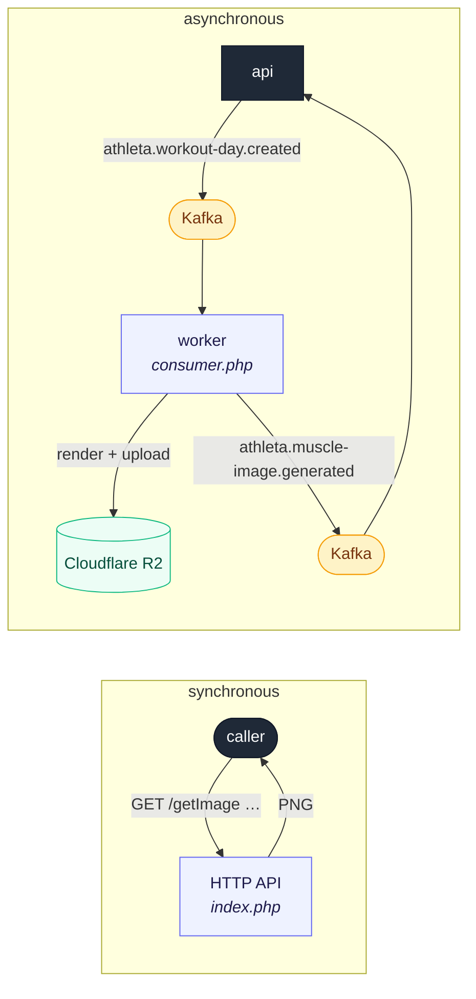

# muscle-image

Renders **anatomical muscle-group images** for Athleta — front/back body diagrams
with chosen muscles highlighted in chosen colors. It runs as two processes from
one PHP codebase: a synchronous **HTTP API** for on-demand rendering, and an
asynchronous **Kafka worker** that pre-renders a workout's muscle map and stores
it in Cloudflare R2.

---

## Why two processes

A muscle map is cheap to *look at* but not free to *generate* — it composites
several overlay PNGs. Two access patterns need it:

- **On demand** — a caller wants an image right now for given muscles/colors. The
  HTTP API renders and returns it in the response.
- **Ahead of time** — when api creates a workout day, its muscle map can be
  rendered once and cached so clients just load a URL. That work shouldn't block
  api's request, so it happens off a Kafka event in the background worker, which
  uploads to R2 and reports the URL back.



Both processes share the same image-compositing code
([controllers/MuscleImageController.php](controllers/MuscleImageController.php));
only the entry point differs — [index.php](index.php) (HTTP) vs
[consumer.php](consumer.php) (worker).

### The worker is idempotent

The worker derives a **content-addressed R2 key** from the render parameters, so
two identical requests resolve to the same object and an already-rendered image is
served from R2 without re-compositing. Reprocessing a Kafka message is therefore
safe.

---

## Synchronous HTTP API

Each endpoint returns an image, or a JSON error. Useful for previews and ad-hoc
rendering.

| Endpoint | Purpose |
| --- | --- |
| `GET /getMuscleGroups` | List the available muscle-group names. |
| `GET /getBaseImage` | The base silhouette, optionally transparent. |
| `GET /getImage` | Highlight one set of muscles in a single color. |
| `GET /getMulticolorImage` | Highlight primary and secondary muscle sets in two colors. |
| `GET /getIndividualColorImage` | Highlight each muscle in its own color. |
| `POST /generateAndStore` | Render for a workout day and upload to R2; returns the URL. |
| `GET /health` | Liveness probe. |

Common query parameter: `transparentBackground` (`0`/`1`, default `0`) is
accepted by every rendering endpoint.

### `GET /getMuscleGroups`

Returns the list of all available muscle groups. No parameters.

```bash
curl "http://localhost/getMuscleGroups"
```

### `GET /getBaseImage`

Returns the base image (silhouette / basic layout).

- `transparentBackground` (optional, default `0`)

```bash
curl "http://localhost/getBaseImage?transparentBackground=1"
```

### `GET /getImage`

Highlights certain muscle groups, with an optional custom color.

- `muscleGroups` (**required**) — comma-separated muscle names.
- `color` (optional) — hex, e.g. `FF0000`. A default is used if omitted.
- `transparentBackground` (optional, default `0`)

```bash
curl "http://localhost/getImage?muscleGroups=biceps,triceps&color=FF0000&transparentBackground=1"
```

### `GET /getMulticolorImage`

Highlights two muscle sets in two different colors.

- `primaryMuscleGroups` (**required**)
- `secondaryMuscleGroups` (**required**)
- `primaryColor` (**required**)
- `secondaryColor` (**required**)
- `transparentBackground` (optional, default `0`)

```bash
curl "http://localhost/getMulticolorImage?primaryMuscleGroups=biceps&secondaryMuscleGroups=triceps&primaryColor=FF0000&secondaryColor=00FF00&transparentBackground=1"
```

### `GET /getIndividualColorImage`

Assigns an individual color to each muscle group. The two lists are positional.

- `muscleGroups` (**required**) — comma-separated, e.g. `biceps,triceps`.
- `colors` (**required**) — comma-separated, e.g. `FF0000,00FF00`. Must match the
  number of muscle groups.
- `transparentBackground` (optional, default `0`)

```bash
curl "http://localhost/getIndividualColorImage?muscleGroups=biceps,triceps&colors=FF0000,00FF00&transparentBackground=1"
```

### `POST /generateAndStore`

Renders a two-color (primary/secondary) muscle map for a workout day and uploads
it to R2, returning the public URL. This is the same work the worker performs;
the endpoint exposes it synchronously for testing or backfills.

```bash
curl -X POST http://localhost/generateAndStore \
  -H "Content-Type: application/json" \
  -d '{
    "workoutDayId": 1,
    "primaryMuscleGroups": "chest,triceps",
    "secondaryMuscleGroups": "shoulders",
    "primaryColor": "255,89,94",
    "secondaryColor": "138,201,38"
  }'
# -> { "url": "https://pub-xxxxx.r2.dev/muscle-images/1.png" }
```

---

## Asynchronous worker

[consumer.php](consumer.php) is a long-lived process (`php consumer.php`) that:

1. Consumes `athleta.workout-day.created` from Kafka (consumer group
   `muscle-image-workers`).
2. Renders the day's muscle map and uploads it to R2 under a content-addressed
   key (skipping the render if the object already exists).
3. Publishes `athleta.muscle-image.generated` with the resulting URL, which api
   consumes and persists on the workout day.

In production it runs as the `muscle-image-worker` container; the HTTP API runs as
`muscle-image-api`. Both are built from the same image.

---

## Configuration & running

The worker needs `KAFKA_BROKERS`; both processes need the Cloudflare R2
credentials (`R2_ACCOUNT_ID`, `R2_ACCESS_KEY_ID`, `R2_SECRET_ACCESS_KEY`,
`R2_BUCKET`, `R2_PUBLIC_URL`). Full storage setup is in
**[README_R2_SETUP.md](README_R2_SETUP.md)**.

```bash
composer install
php -S localhost:80 index.php   # HTTP API (or serve via the provided Dockerfile)
php consumer.php                # the Kafka worker
```

From the repo root, `docker compose up muscle-image-api muscle-image-worker`
runs both against the shared Kafka and R2 configuration.
